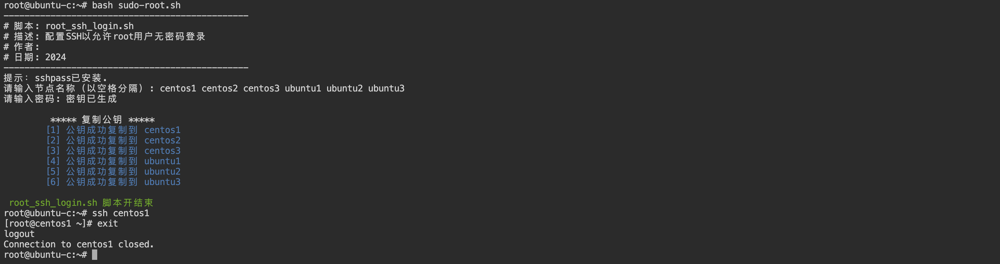

+++
title = '1 Ansible简介'
date = 2024-04-08T15:56:38+08:00
draft = true
+++

### Ansible 简述

此前，很多的shell 脚本的编写，没有任何真正容易简单的事情。并不像是编写Shell脚本 并在服务器上运行那么简单，尤其是必须在服务器上安装东西。

Ansible的出现使事情变得更加简单：

+ 不必了解某些特定的编程语言
+ 基本上可以将 Shell 脚本简单的转换成 Ansible 脚本 - “剧本”，甚至无需使用特殊的 ansible 模块 或逻辑，非常轻松的运行所有服务器。


作为初级到中级的Linux 管理员，需要掌握大规模基础设施的自动化。


Devops for Ansible

+ Devops 对我来说 更多的是一种哲学，而不一定是一个职位或者角色。这种理念是开发和运维紧密联系。
+ 当开发人员接管管道，从某种意义上来说，能够将开发和运维混合在一起。
+ 仍然是需要 SRE 或 系统管理员来运行服务器并确保应用程序的正常运行，并且还有专门构建应用程序的开发人员。


从Ansible 历史

+ 最初：允许在多台服务器上运行命令。
+ 目标：清晰、完整、快速、高效和安全。


Ansible 通过SSH与机器服务器交互，无需安装代理-守护进程或者在服务器上为自动化工具提供端口。

安全：使用安全传输协议


很多时候自动化的动机时：希望能够设置服务器，或者构建容器。

喜欢ansible 原因之一：可以将 shell脚本，shell 命令以及其他的任务转移到Ansible中，让Ansible去做它们。


### 安装 Ansible

```sh
pip3 install ansible
```

版本：

```sh
ansible@ubuntu-c:~$ ansible --version
ansible [core 2.14.11]
  config file = None
  configured module search path = ['/home/ansible/.ansible/plugins/modules', '/usr/share/ansible/plugins/modules']
  ansible python module location = /usr/local/lib/python3.10/dist-packages/ansible
  ansible collection location = /home/ansible/.ansible/collections:/usr/share/ansible/collections
  executable location = /usr/local/bin/ansible
  python version = 3.10.12 (main, Jun 11 2023, 05:26:28) [GCC 11.4.0] (/usr/bin/python3)
  jinja version = 3.1.2
  libyaml = True
```


实验环境：


root 免密登陆：

 

也可以基于密码认证


创建：inventroy 文件

```sh
[example]
ubuntu[1:3]
centos[1:3
```

测试：

```sh
ansible -i inventroy example -m ping
```


创建 ansible.cfg , 将覆盖默认配置

模版命令：$ ansible-config init --disabled > ansible.cfg

```sh
[defaults]
INVENTORY = inventory
```


构建虚拟机或者Docker 在其中实现自动化，完成后删除所有内容

第一个Playbook

```yaml
---
- name: Set up NTP no all servers.
  hosts: all
  become: yes
  tasks:
    - name: Ensure NTP is Install
      yum: 
        name: chrony
        state: present

    - name:
      shell: |
        if ! rpm -qa | grep -qw chrony; then
          yum install -y chrony
        fi

    - name: Ensure NTP is Running
      systemd:
        state: started
        name: chronyd
        enabled: yes
```

甚至可以删除注释, 最好添加 name，确切的知道任务具体内容

```yaml
- hosts: all
  become: yes
  tasks:
    - yum: name=chrony state=present
    - systemd: state=started name=chronyd enabled=yes
```


幂等性：command 和 yum 同时存在安装同一软件，运行第二个时会提示已经更改


在学习 Ansible 之前，我实际上一直实验shell 脚本，有很多的 Shell 脚本，我喜欢能够在服务器上多次运行，但是维护起来非常困难。

Ansible 将这些抽象出来，语句更容易使用
