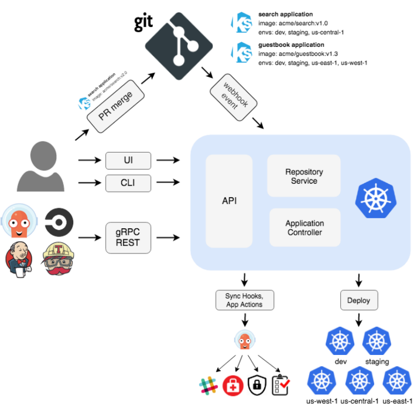

+++
title = '第一章：Argocd-Kubernetes的GitOpsCD'
date = 2024-04-26T14:32:59+08:00
draft = true

+++

## 1-简述

ArgoCD 是一种 GitOps 持续交付工具，在 DevOps 中越来越受欢迎。

 

官网：https://argo-cd.readthedocs.io/en/stable/

学习前必备知识：

+ docker 、kubernetes、HELM(可选)、CICD工具其一即可（gitlab、github、jenkins）

Argo CD : 持续交付工具，将Argocd理解成CD工具或持续交付的工具，对比实验 Jenkins 或者 gitlab 中的持续交付。

所以，Argocd 并不存在取代 jenkins 或者 gitlab等等说法

设计实验仓库：

https://gitlab.com/mymicroservice-cicd9154417

### 1-1 不使用 ArgoCD 的 CD 工作流程

假设我们有一套服务运行在 k8s集群。

当我们新增功能或者代码发生改变时，使用 jenkins 或者 gitlab 构建的 ci 管道构建了新的镜像，并将其推送到仓库，此时这个镜像如何部署？

1. 使用 yml 更新镜像tag，部署到集群，这些操作是 CI 管道的延续
2. 因此 jenkins 或 gitlab 将更新应用程序的部署 yml，并使用 kubectl 去更新部署

这种方法存在的挑战：

1. 需要设置安装kubectl 或者 helm等工具来访问集群
2. 还需要为这些工具配置访问，连接凭据 【如果使用的是云集群，还需要配置 ak、sk等等】

引出的问题：配置工作量、安全问题【将集群凭证和 云凭证提供给了外部服务】

另一个问题：

1. 使用管道部署后，无法进一步了解应用程序状态。管道并不知道执行 更新后负载的状态 【即使可以通过脚本去实现，但将会使管道冗余和加长管道执行时间】

### 1-2 使用 ArgoCD 的 CD 工作流程

Argo CD 结合 Gitlab 将更加高效，可以持续交付的 kubernetes。

Argocd 如何解决之前的困难：【反转流程】不再使用jenkins 、gitlab的管道直接使用kubectl 去更新

1. Argocd 本身可以是 kubernetes 集群一部分
2. Argocd 通过 pull 拉取 git仓库，并将更改应用。

替换管道中kubectl后流程：

1. CI管道：TEST、BUILD、PUSH镜像仓库、Update yml
2. 提交后 Argo cd pull git仓库发现需要更改

【git 一个最佳实践】：开发代码与 部署yml 独立
