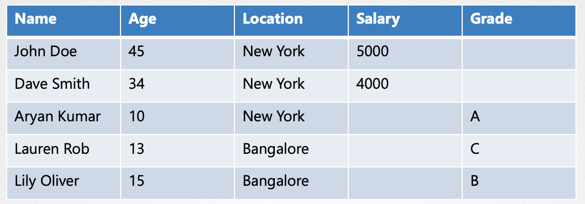
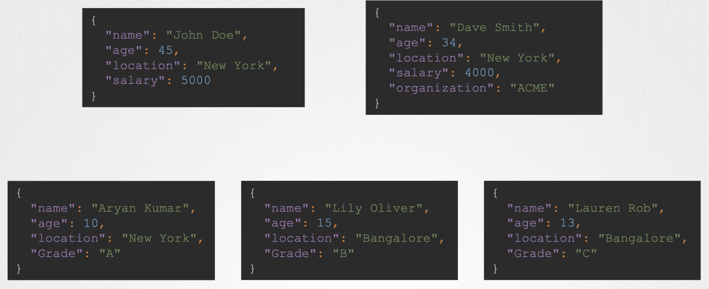

+++
title = 'cka-2: 核心概念'
date = 2024-05-15T15:13:55+08:00
draft = true

+++

​		这将是第一部分，将从较高层次了解集群体系结构，然后了解一些API，例如 Pod、Replicaset、deployment等

## 核心概念

### 集群架构基本概述

Kubernetes 集群由一组节点组成，可以是 物理节点、虚拟节点、本地节点、云节点等。

以容器的方式托管应用程序

+ worker nodes：运行容器
+ master worker：负责管理 Kuberntes 集群、存储有关不同节点信息、规划容器去向、监控节点及其上的容器等。

master 节点使用一组控制组件完成这些操作

+ Etcd 集群：记录集群中所有信息

+ Kube-scheduler：调度器基于容器资源要求，工作节点容量或者任何其他策略或约束（例如，污点、容忍、亲和性规则）来识别容器放置的正确节点。

+ Controller：控制器处理不同的区域，

  + 节点控制器：负责管理节点、将节点加载到集群、处理节点变得不可以或者被破坏等情况。
  + Replicaset 控制器：负责确保始终运行所需数量的容器。

  【说明】现在已经有这么多组件，谁对它们进行高级管理？

+ kube APIserver：负责协调集群中所有操作，公开了API（外部用户使用该API在集群上执行管理操作）以及各种控制器（用于监控集群状态并根据需要进行必要更改） 和 工作节点（用于与服务器通信）

+ Containerd：集群中所有节点安装，CRI支持的引擎

+ Kubelet：

  + 负责与 kube-Apiserver 通信，收集节点信息和节点上Pod状态等等。
  + 每个节点上运行的代理，监听KubeAPIServer指令，并根据需要在节点上部署或者销毁容器。
  + KubeAPIServer 定期从Kubelet 获取状态报告，以监视节点和容器状态

  【说明】Kubelet 负责管理Pod、但在工作节点上运行的应用程序需要能够相互通信

+ Kube-Proxy：确保了工作节点上有必要的规则以运行这些节点上运行的容器相互访问

+ CoreDNS：负责集群中域名解析

 

### ETCD 介绍

what is ETCD？

​		一种分布式可靠的键值存储、简单、安全且快速

what is 键值存储 ？

​		传统中 数据库采用 表格格式，SQL 或关系型数据库。

 

key-value 

+ 通常通过 JSON 或 YAML等数据格式进行处理

 

Install ETCD

1. 下载

```sh
curl -L https://github.com/etcd-io/etcd/releases/download/v3.3.11/etcd-v3.3.11-linux-amd64.tar.gz -o etcd-v3.3.11-linux-amd64.tar.gz
```

2. 减压

```sh
tar xzvf etcd-v3.3.11-linux-amd64.tar.gz
```

3. Run ETCD Service

```sh
./etcd
```

默认情况下会启动监听 2379端口的服务，可以连接到 ETCD服务存储和检索信息

ETCD 附带的默认客户端：etcdctl

```sh
./etcdctl set key1 value1
./etcdctl get key1
```

